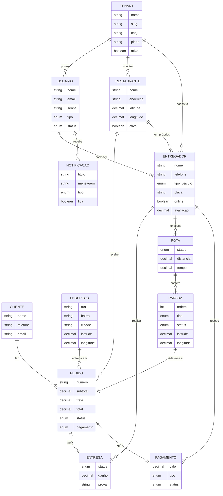

# Diagrama E-R - Banco de Dados MuvLog

## 1. Diagrama Conceitual

O diagrama conceitual mostra as entidades principais e seus relacionamentos em alto nível, sem detalhes de implementação.



---

## 2. Diagrama Lógico

O diagrama lógico detalha as entidades com atributos, tipos e chaves estrangeiras.

```mermaid
erDiagram
    %% ===== TABELAS DE CONFIGURAÇÃO =====
    tenants {
        int id PK
        string name
        string slug UK
        string cnpj
        string plan
        int max_deliveries_month
        int max_drivers
        boolean is_active
        datetime created_at
    }
    
    squares {
        int id PK
        int tenant_id FK
        string name
        string city
        string state
        decimal price_per_km
        decimal min_distance_km
        boolean is_active
    }
    
    pricing_tables {
        int id PK
        int square_id FK
        string name
        decimal base_fee
        decimal per_km_rate
        decimal min_delivery_fee
        boolean is_active
    }
    
    route_settings {
        int id PK
        int tenant_id FK
        boolean auto_routing_enabled
        int auto_routing_interval_min
        int max_orders_auto
        int max_orders_manual
        decimal max_distance_km
        decimal direction_weight
        decimal distance_weight
        boolean include_scheduled
        boolean include_pending
        boolean include_accepted
        boolean include_preparing
        boolean include_ready
    }
    
    %% ===== TABELAS DE USUÁRIOS =====
    users {
        int id PK
        int tenant_id FK
        string email UK
        string password_hash
        string first_name
        string last_name
        string phone
        string cpf
        enum user_type
        enum status
        datetime created_at
    }
    
    drivers {
        int id PK
        int tenant_id FK
        int user_id FK
        int square_id FK
        enum vehicle_type
        string vehicle_plate
        string vehicle_model
        boolean is_online
        decimal current_latitude
        decimal current_longitude
        decimal rating
        int total_deliveries
        decimal balance
        decimal locked_balance
        string pix_key
        boolean is_blocked
        datetime created_at
    }
    
    %% ===== TABELAS DE ESTABELECIMENTOS =====
    restaurants {
        int id PK
        int tenant_id FK
        int square_id FK
        int pricing_table_id FK
        string name
        string cnpj
        string address
        decimal latitude
        decimal longitude
        boolean has_own_drivers
        boolean is_active
        int preparation_minutes
        string own_driver_payment_type
        decimal own_driver_fixed_value
        decimal own_driver_km_value
        datetime created_at
    }
    
    establishment_drivers {
        int id PK
        int restaurant_id FK
        string name
        string phone
        string pin_hash
        string vehicle_type
        string vehicle_plate
        boolean is_online
        boolean is_active
        decimal rating
        int total_deliveries
        datetime created_at
    }
    
    %% ===== TABELAS DE CLIENTES =====
    customers {
        int id PK
        int user_id FK
        string name
        string phone
        string email
        datetime created_at
    }
    
    addresses {
        int id PK
        int customer_id FK
        string street
        string neighborhood
        string city
        string state
        string zip_code
        string complement
        decimal latitude
        decimal longitude
    }
    
    %% ===== TABELAS DE PEDIDOS =====
    orders {
        int id PK
        int tenant_id FK
        int restaurant_id FK
        int customer_id FK
        int delivery_address_id FK
        int driver_id FK
        int own_driver_route_id FK
        int platform_route_id FK
        int establishment_driver_id FK
        string order_number UK
        string tracking_token UK
        json items
        decimal subtotal
        decimal delivery_fee
        decimal total_amount
        enum payment_method
        enum status
        string distribution_method
        datetime scheduled_at
        datetime delivery_time
        datetime accepted_at
        datetime picked_up_at
        string pickup_code
        string delivery_code
        boolean assigned_to_own_driver
        boolean called_platform
        datetime created_at
    }
    
    %% ===== TABELAS DE ROTAS =====
    own_driver_routes {
        int id PK
        int establishment_driver_id FK
        int restaurant_id FK
        string status
        decimal total_distance_km
        decimal total_duration_min
        datetime started_at
        datetime completed_at
        datetime created_at
    }
    
    own_driver_stops {
        int id PK
        int route_id FK
        int order_id FK
        int stop_order
        string stop_type
        decimal latitude
        decimal longitude
        string address
        string status
        datetime completed_at
        datetime created_at
    }
    
    platform_driver_routes {
        int id PK
        int driver_id FK
        int restaurant_id FK
        string status
        decimal total_distance_km
        decimal total_duration_min
        datetime started_at
        datetime completed_at
        datetime created_at
    }
    
    platform_driver_stops {
        int id PK
        int route_id FK
        int order_id FK
        int restaurant_id FK
        int stop_order
        string stop_type
        decimal latitude
        decimal longitude
        string address
        string status
        datetime completed_at
        datetime created_at
    }
    
    delivery_routes {
        int id PK
        int tenant_id FK
        int driver_id FK
        string route_number UK
        string status
        int total_stops
        int completed_stops
        decimal total_distance_km
        datetime created_at
    }
    
    %% ===== TABELAS DE ENTREGAS E PAGAMENTOS =====
    deliveries {
        int id PK
        int order_id FK
        int driver_id FK
        enum status
        decimal driver_earnings
        string proof_of_delivery_url
        datetime picked_up_at
        datetime delivered_at
        datetime created_at
    }
    
    payments {
        int id PK
        int driver_id FK
        int order_id FK
        decimal amount
        enum type
        enum status
        string payment_method
        datetime processed_at
        datetime created_at
    }
    
    own_driver_earnings {
        int id PK
        int restaurant_id FK
        int establishment_driver_id FK
        int order_id FK
        decimal delivery_fee
        decimal driver_earning
        string payment_type
        decimal distance_km
        boolean is_paid
        datetime paid_at
        datetime created_at
    }
    
    %% ===== TABELAS DE NOTIFICAÇÕES =====
    notifications {
        int id PK
        int user_id FK
        string title
        string message
        enum type
        int related_id
        boolean is_read
        datetime created_at
    }
    
    %% ===== TABELAS AUXILIARES =====
    driver_restaurants {
        int id PK
        int driver_id FK
        int restaurant_id FK
        boolean is_priority
        datetime created_at
    }
    
    driver_penalties {
        int id PK
        int driver_id FK
        int order_id FK
        string penalty_type
        string reason
        boolean is_active
        datetime created_at
    }
    
    driver_scores {
        int id PK
        int driver_id FK
        int score
        string reason
        datetime created_at
    }
    
    driver_achievements {
        int id PK
        int driver_id FK
        string achievement_name
        string description
        datetime achieved_at
    }
    
    platform_credentials {
        int id PK
        int restaurant_id FK
        string platform
        string client_id
        string client_secret
        boolean is_active
        datetime expires_at
    }
    
    invoices {
        int id PK
        int restaurant_id FK
        int tenant_id FK
        decimal amount
        string status
        datetime due_date
        datetime paid_at
        datetime created_at
    }
    
    withdrawals {
        int id PK
        int driver_id FK
        decimal amount
        string status
        string pix_key
        datetime processed_at
        datetime created_at
    }
    
    system_configs {
        int id PK
        string key UK
        json value
        datetime updated_at
    }
    
    %% ===== RELACIONAMENTOS =====
    tenants ||--o{ users : "possui"
    tenants ||--o{ squares : "contém"
    tenants ||--o{ restaurants : "contém"
    tenants ||--o{ drivers : "cadastra"
    tenants ||--o{ route_settings : "configura"
    
    squares ||--o{ restaurants : "contém"
    squares ||--o{ drivers : "opera em"
    squares ||--o{ pricing_tables : "tem"
    
    users ||--o| drivers : "pode ser"
    users ||--o{ notifications : "recebe"
    
    restaurants ||--o{ orders : "recebe"
    restaurants ||--o{ establishment_drivers : "tem"
    restaurants ||--o{ own_driver_routes : "cria"
    restaurants ||--o{ platform_driver_stops : "coleta de"
    restaurants ||--o{ driver_restaurants : "vincula"
    restaurants ||--o{ platform_credentials : "tem"
    restaurants ||--o{ invoices : "gera"
    
    customers ||--o{ orders : "faz"
    addresses ||--o{ orders : "entrega em"
    
    orders ||--o| deliveries : "gera"
    orders ||--o{ payments : "gera"
    orders ||--o{ own_driver_earnings : "gera"
    orders ||--o{ driver_penalties : "pode gerar"
    orders }o--o| own_driver_routes : "em rota"
    orders }o--o| platform_driver_routes : "em rota"
    orders }o--o| delivery_routes : "em rota"
    orders }o--o| establishment_driver : "entregador próprio"
    orders }o--o| drivers : "entregador plataforma"
    
    drivers ||--o{ deliveries : "realiza"
    drivers ||--o{ payments : "recebe"
    drivers ||--o{ platform_driver_routes : "executa"
    drivers ||--o{ driver_restaurants : "vinculado a"
    drivers ||--o{ driver_penalties : "recebe"
    drivers ||--o{ driver_scores : "tem"
    drivers ||--o{ driver_achievements : "conquista"
    drivers ||--o{ withdrawals : "solicita"
    
    establishment_drivers ||--o{ own_driver_routes : "executa"
    establishment_drivers ||--o{ own_driver_earnings : "ganha"
    
    own_driver_routes ||--o{ own_driver_stops : "tem"
    own_driver_stops }o--|| orders : "refere-se a"
    
    platform_driver_routes ||--o{ platform_driver_stops : "tem"
    platform_driver_stops }o--|| orders : "refere-se a"
    
    delivery_routes ||--o{ orders : "contém"
    
    pricing_tables ||--o{ restaurants : "usada por"
```



---

## 3. Diagrama Físico

O diagrama físico mostra as tabelas reais do banco PostgreSQL com tipos de dados exatos.

```mermaid
erDiagram
    %% ===== TABELAS PRINCIPAIS =====
    
    tenants {
        SERIAL id PK
        VARCHAR(200) name NOT NULL
        VARCHAR(100) slug UNIQUE NOT NULL
        VARCHAR(500) logo_url
        VARCHAR(7) primary_color DEFAULT '#6366f1'
        VARCHAR(7) secondary_color DEFAULT '#ffffff'
        VARCHAR(200) domain
        VARCHAR(20) phone
        VARCHAR(255) email
        VARCHAR(500) address
        VARCHAR(18) cnpj
        VARCHAR(50) plan DEFAULT 'free'
        INTEGER max_deliveries_month DEFAULT 100
        INTEGER max_drivers DEFAULT 2
        INTEGER max_clients DEFAULT 20
        VARCHAR(200) custom_domain
        VARCHAR(500) terms_url
        VARCHAR(500) privacy_url
        BOOLEAN is_active DEFAULT true
        TIMESTAMP created_at DEFAULT NOW()
        TIMESTAMP updated_at DEFAULT NOW()
    }
    
    users {
        SERIAL id PK
        INTEGER tenant_id FK
        VARCHAR(255) email NOT NULL
        VARCHAR(255) password_hash NOT NULL
        VARCHAR(100) first_name NOT NULL
        VARCHAR(100) last_name NOT NULL
        VARCHAR(20) phone
        VARCHAR(14) cpf
        DATE birth_date
        VARCHAR(500) profile_picture_url
        user_type_enum user_type NOT NULL
        user_status_enum status DEFAULT 'ACTIVE'
        TIMESTAMP created_at DEFAULT NOW()
        TIMESTAMP updated_at DEFAULT NOW()
    }
    
    drivers {
        SERIAL id PK
        INTEGER tenant_id FK
        INTEGER user_id FK NOT NULL
        INTEGER square_id FK
        vehicle_type_enum vehicle_type NOT NULL
        VARCHAR(10) vehicle_plate
        VARCHAR(100) vehicle_model
        INTEGER vehicle_year
        VARCHAR(50) bank_account
        BOOLEAN is_online DEFAULT false
        NUMERIC(10,8) current_latitude
        NUMERIC(11,8) current_longitude
        TIMESTAMP last_location_update
        NUMERIC(3,2) rating DEFAULT 5.00
        INTEGER total_deliveries DEFAULT 0
        INTEGER max_concurrent_orders DEFAULT 3
        INTEGER queue_position DEFAULT 0
        TIMESTAMP last_order_at
        INTEGER total_orders_today DEFAULT 0
        INTEGER rejection_count DEFAULT 0
        BOOLEAN is_blocked DEFAULT false
        TIMESTAMP blocked_until
        NUMERIC(10,2) balance DEFAULT 0
        NUMERIC(10,2) locked_balance DEFAULT 0
        VARCHAR(100) pix_key
        TIMESTAMP created_at DEFAULT NOW()
        TIMESTAMP updated_at DEFAULT NOW()
    }
    
    restaurants {
        SERIAL id PK
        INTEGER tenant_id FK
        INTEGER square_id FK
        INTEGER pricing_table_id FK
        VARCHAR(200) name NOT NULL
        VARCHAR(18) cnpj
        VARCHAR(20) phone
        VARCHAR(255) email
        VARCHAR(500) address NOT NULL
        NUMERIC(10,8) latitude NOT NULL
        NUMERIC(11,8) longitude NOT NULL
        JSON opening_hours
        BOOLEAN is_active DEFAULT true
        INTEGER preparation_minutes DEFAULT 10
        BOOLEAN has_own_drivers DEFAULT false
        VARCHAR(20) subscription_type
        TIMESTAMP subscription_expires_at
        INTEGER platform_pricing_table_id FK
        BOOLEAN enable_platform_routing DEFAULT false
        VARCHAR(30) own_driver_payment_type DEFAULT 'PER_DELIVERY'
        NUMERIC(10,2) own_driver_fixed_value DEFAULT 5.00
        NUMERIC(10,2) own_driver_km_value DEFAULT 1.50
        NUMERIC(5,2) own_driver_percentage DEFAULT 70.00
        NUMERIC(10,2) own_driver_delivery_value DEFAULT 3.00
        INTEGER own_driver_max_deliveries DEFAULT 10
        VARCHAR(100) bank_name
        VARCHAR(20) bank_agency
        VARCHAR(30) bank_account
        VARCHAR(100) bank_pix_key
        VARCHAR(50) asaas_customer_id
        VARCHAR(20) pickup_confirmation_type DEFAULT 'code'
        VARCHAR(20) delivery_confirmation_type DEFAULT 'code'
        TIMESTAMP created_at DEFAULT NOW()
        TIMESTAMP updated_at DEFAULT NOW()
    }
    
    customers {
        SERIAL id PK
        INTEGER user_id FK
        VARCHAR(200) name NOT NULL
        VARCHAR(20) phone
        VARCHAR(255) email
        TIMESTAMP created_at DEFAULT NOW()
    }
    
    addresses {
        SERIAL id PK
        INTEGER customer_id FK NOT NULL
        VARCHAR(500) street NOT NULL
        VARCHAR(200) neighborhood
        VARCHAR(100) city
        VARCHAR(2) state
        VARCHAR(10) zip_code
        VARCHAR(200) complement
        NUMERIC(10,8) latitude
        NUMERIC(11,8) longitude
        TIMESTAMP created_at DEFAULT NOW()
    }
    
    orders {
        SERIAL id PK
        INTEGER tenant_id FK
        INTEGER square_id FK
        INTEGER restaurant_id FK NOT NULL
        INTEGER customer_id FK NOT NULL
        INTEGER delivery_address_id FK NOT NULL
        INTEGER driver_id FK
        INTEGER own_driver_route_id FK
        INTEGER platform_route_id FK
        INTEGER establishment_driver_id FK
        VARCHAR(50) order_number NOT NULL
        VARCHAR(36) tracking_token UNIQUE
        JSON items NOT NULL
        NUMERIC(10,2) subtotal NOT NULL
        NUMERIC(10,2) delivery_fee NOT NULL
        NUMERIC(10,2) total_amount NOT NULL
        payment_method_enum payment_method NOT NULL
        order_status_enum status DEFAULT 'PENDING'
        VARCHAR(20) distribution_method DEFAULT 'nearest'
        TIMESTAMP scheduled_at
        TIMESTAMP estimated_delivery_time
        TIMESTAMP pickup_time
        TIMESTAMP delivery_time
        TIMESTAMP accepted_at
        TIMESTAMP offered_at
        INTEGER offer_attempts DEFAULT 0
        TIMESTAMP preparing_at
        TIMESTAMP ready_at
        TIMESTAMP picked_up_at
        TEXT special_instructions
        VARCHAR(6) pickup_code
        VARCHAR(6) delivery_code
        VARCHAR(100) external_id
        VARCHAR(20) platform_source
        BOOLEAN assigned_to_own_driver DEFAULT false
        BOOLEAN called_platform DEFAULT false
        TIMESTAMP created_at DEFAULT NOW()
        TIMESTAMP updated_at DEFAULT NOW()
    }
    
    %% ===== TABELAS DE ROTAS =====
    
    own_driver_routes {
        SERIAL id PK
        INTEGER establishment_driver_id FK
        INTEGER restaurant_id FK
        VARCHAR(20) status DEFAULT 'PENDING'
        NUMERIC(10,2) total_distance_km
        NUMERIC(10,2) total_duration_min
        TIMESTAMP started_at
        TIMESTAMP completed_at
        TIMESTAMP created_at DEFAULT NOW()
    }
    
    own_driver_stops {
        SERIAL id PK
        INTEGER route_id FK NOT NULL
        INTEGER order_id FK NOT NULL
        INTEGER stop_order NOT NULL
        VARCHAR(20) stop_type
        NUMERIC(10,8) latitude
        NUMERIC(11,8) longitude
        VARCHAR(500) address
        VARCHAR(20) status DEFAULT 'PENDING'
        TIMESTAMP arrived_at
        TIMESTAMP completed_at
        TIMESTAMP created_at DEFAULT NOW()
    }
    
    platform_driver_routes {
        SERIAL id PK
        INTEGER driver_id FK NOT NULL
        INTEGER restaurant_id FK
        VARCHAR(20) status DEFAULT 'PENDING'
        NUMERIC(10,2) total_distance_km
        NUMERIC(10,2) total_duration_min
        TIMESTAMP started_at
        TIMESTAMP completed_at
        TIMESTAMP created_at DEFAULT NOW()
    }
    
    platform_driver_stops {
        SERIAL id PK
        INTEGER route_id FK NOT NULL
        INTEGER order_id FK NOT NULL
        INTEGER restaurant_id FK
        INTEGER stop_order NOT NULL
        VARCHAR(20) stop_type
        NUMERIC(10,8) latitude
        NUMERIC(11,8) longitude
        VARCHAR(500) address
        VARCHAR(20) status DEFAULT 'PENDING'
        TIMESTAMP arrived_at
        TIMESTAMP completed_at
        TIMESTAMP created_at DEFAULT NOW()
    }
    
    delivery_routes {
        SERIAL id PK
        INTEGER tenant_id FK
        INTEGER driver_id FK
        VARCHAR(50) route_number UNIQUE NOT NULL
        VARCHAR(20) status DEFAULT 'pending'
        INTEGER total_stops DEFAULT 0
        INTEGER completed_stops DEFAULT 0
        NUMERIC(8,2) total_distance_km
        INTEGER estimated_duration_minutes
        TIMESTAMP created_at DEFAULT NOW()
        TIMESTAMP updated_at DEFAULT NOW()
    }
    
    %% ===== TABELAS DE ENTREGAS E PAGAMENTOS =====
    
    deliveries {
        SERIAL id PK
        INTEGER order_id FK NOT NULL
        INTEGER driver_id FK
        delivery_status_enum status DEFAULT 'PENDING'
        NUMERIC(10,2) driver_earnings
        VARCHAR(500) proof_of_delivery_url
        TIMESTAMP picked_up_at
        TIMESTAMP delivered_at
        TIMESTAMP created_at DEFAULT NOW()
    }
    
    payments {
        SERIAL id PK
        INTEGER driver_id FK NOT NULL
        INTEGER order_id FK
        NUMERIC(10,2) amount NOT NULL
        payment_type_enum type NOT NULL
        payment_status_enum status DEFAULT 'PENDING'
        VARCHAR(20) payment_method
        TIMESTAMP processed_at
        TIMESTAMP created_at DEFAULT NOW()
    }
    
    own_driver_earnings {
        SERIAL id PK
        INTEGER restaurant_id FK NOT NULL
        INTEGER establishment_driver_id FK NOT NULL
        INTEGER order_id FK NOT NULL
        NUMERIC(10,2) delivery_fee NOT NULL
        NUMERIC(10,2) driver_earning NOT NULL
        VARCHAR(30) payment_type
        NUMERIC(10,2) distance_km
        BOOLEAN is_paid DEFAULT false
        TIMESTAMP paid_at
        VARCHAR(20) payment_method
        TIMESTAMP created_at DEFAULT NOW()
    }
    
    %% ===== TABELAS DE NOTIFICAÇÕES =====
    
    notifications {
        SERIAL id PK
        INTEGER user_id FK NOT NULL
        VARCHAR(200) title NOT NULL
        TEXT message NOT NULL
        notification_type_enum type NOT NULL
        INTEGER related_id
        BOOLEAN is_read DEFAULT false
        TIMESTAMP created_at DEFAULT NOW()
    }
    
    %% ===== TABELAS AUXILIARES =====
    
    squares {
        SERIAL id PK
        INTEGER tenant_id FK
        VARCHAR(200) name NOT NULL
        VARCHAR(100) city NOT NULL
        VARCHAR(2) state NOT NULL
        NUMERIC(10,2) price_per_km
        NUMERIC(10,2) max_delivery_fee
        NUMERIC(5,2) min_distance_km
        NUMERIC(5,2) driver_percentage
        BOOLEAN is_active DEFAULT true
        TIMESTAMP created_at DEFAULT NOW()
    }
    
    pricing_tables {
        SERIAL id PK
        INTEGER square_id FK
        VARCHAR(100) name NOT NULL
        NUMERIC(10,2) base_fee NOT NULL
        NUMERIC(10,2) per_km_rate NOT NULL
        NUMERIC(10,2) min_delivery_fee
        NUMERIC(10,2) max_delivery_fee
        NUMERIC(5,2) min_distance_km
        BOOLEAN is_active DEFAULT true
        TIMESTAMP created_at DEFAULT NOW()
    }
    
    dynamic_pricing {
        SERIAL id PK
        INTEGER square_id FK
        VARCHAR(100) name NOT NULL
        NUMERIC(5,2) multiplier DEFAULT 1.00
        TIME start_time
        TIME end_time
        VARCHAR(20) day_of_week
        BOOLEAN is_active DEFAULT true
        TIMESTAMP created_at DEFAULT NOW()
    }
    
    route_settings {
        SERIAL id PK
        INTEGER tenant_id FK
        BOOLEAN auto_routing_enabled DEFAULT true
        INTEGER auto_routing_interval_min DEFAULT 5
        INTEGER max_orders_auto DEFAULT 6
        INTEGER max_orders_manual DEFAULT 10
        NUMERIC(5,2) max_distance_km DEFAULT 10.00
        NUMERIC(3,2) direction_weight DEFAULT 0.70
        NUMERIC(3,2) distance_weight DEFAULT 0.30
        INTEGER min_time_savings_min DEFAULT 10
        NUMERIC(3,2) min_clusterization DEFAULT 0.70
        BOOLEAN include_scheduled DEFAULT false
        INTEGER scheduled_advance_min DEFAULT 30
        BOOLEAN include_pending DEFAULT true
        BOOLEAN include_accepted DEFAULT true
        BOOLEAN include_preparing DEFAULT true
        BOOLEAN include_ready DEFAULT true
        BOOLEAN notify_admin_auto_route DEFAULT true
        BOOLEAN notify_driver_auto_route DEFAULT true
        TIMESTAMP created_at DEFAULT NOW()
        TIMESTAMP updated_at DEFAULT NOW()
    }
    
    establishment_drivers {
        SERIAL id PK
        INTEGER restaurant_id FK NOT NULL
        VARCHAR(200) name NOT NULL
        VARCHAR(20) phone
        VARCHAR(512) pin_hash
        VARCHAR(20) vehicle_type
        VARCHAR(10) vehicle_plate
        VARCHAR(100) vehicle_model
        BOOLEAN is_online DEFAULT false
        NUMERIC(10,8) current_latitude
        NUMERIC(11,8) current_longitude
        BOOLEAN is_active DEFAULT true
        VARCHAR(20) payment_frequency DEFAULT 'WEEKLY'
        NUMERIC(3,2) rating DEFAULT 5.00
        INTEGER total_deliveries DEFAULT 0
        INTEGER total_ratings DEFAULT 0
        TIMESTAMP created_at DEFAULT NOW()
        TIMESTAMP updated_at DEFAULT NOW()
    }
    
    driver_restaurants {
        SERIAL id PK
        INTEGER driver_id FK NOT NULL
        INTEGER restaurant_id FK NOT NULL
        BOOLEAN is_priority DEFAULT false
        TIMESTAMP created_at DEFAULT NOW()
    }
    
    driver_penalties {
        SERIAL id PK
        INTEGER driver_id FK NOT NULL
        INTEGER order_id FK
        VARCHAR(50) penalty_type NOT NULL
        VARCHAR(500) reason
        BOOLEAN is_active DEFAULT true
        TIMESTAMP created_at DEFAULT NOW()
    }
    
    driver_scores {
        SERIAL id PK
        INTEGER driver_id FK NOT NULL
        INTEGER score NOT NULL
        VARCHAR(500) reason
        TIMESTAMP created_at DEFAULT NOW()
    }
    
    driver_achievements {
        SERIAL id PK
        INTEGER driver_id FK NOT NULL
        VARCHAR(100) achievement_name NOT NULL
        VARCHAR(500) description
        TIMESTAMP achieved_at DEFAULT NOW()
    }
    
    driver_bonus {
        SERIAL id PK
        INTEGER driver_id FK NOT NULL
        VARCHAR(100) bonus_type NOT NULL
        NUMERIC(10,2) amount NOT NULL
        VARCHAR(500) description
        BOOLEAN is_paid DEFAULT false
        TIMESTAMP created_at DEFAULT NOW()
    }
    
    platform_credentials {
        SERIAL id PK
        INTEGER restaurant_id FK NOT NULL
        VARCHAR(20) platform NOT NULL
        VARCHAR(100) client_id
        VARCHAR(500) client_secret
        VARCHAR(500) access_token
        VARCHAR(500) refresh_token
        BOOLEAN is_active DEFAULT true
        TIMESTAMP expires_at
        TIMESTAMP created_at DEFAULT NOW()
    }
    
    invoices {
        SERIAL id PK
        INTEGER restaurant_id FK NOT NULL
        INTEGER tenant_id FK
        NUMERIC(10,2) amount NOT NULL
        VARCHAR(20) status DEFAULT 'PENDING'
        DATE due_date
        TIMESTAMP paid_at
        VARCHAR(50) asaas_invoice_id
        TIMESTAMP created_at DEFAULT NOW()
    }
    
    withdrawals {
        SERIAL id PK
        INTEGER driver_id FK NOT NULL
        NUMERIC(10,2) amount NOT NULL
        VARCHAR(20) status DEFAULT 'PENDING'
        VARCHAR(100) pix_key NOT NULL
        TIMESTAMP processed_at
        VARCHAR(200) rejection_reason
        TIMESTAMP created_at DEFAULT NOW()
    }
    
    establishment_subscriptions {
        SERIAL id PK
        INTEGER restaurant_id FK NOT NULL
        INTEGER tenant_id FK
        VARCHAR(20) billing_cycle DEFAULT 'WEEKLY'
        NUMERIC(10,2) price_per_driver DEFAULT 50.00
        NUMERIC(10,2) fixed_price DEFAULT 0
        BOOLEAN is_active DEFAULT true
        TIMESTAMP last_billed_at
        TIMESTAMP next_billing_at
        NUMERIC(10,2) total_billed DEFAULT 0
        NUMERIC(10,2) total_paid DEFAULT 0
        VARCHAR(100) asaas_subscription_id
        TIMESTAMP created_at DEFAULT NOW()
        TIMESTAMP updated_at DEFAULT NOW()
    }
    
    system_configs {
        SERIAL id PK
        VARCHAR(100) key UNIQUE NOT NULL
        JSON value NOT NULL
        TIMESTAMP updated_at DEFAULT NOW()
    }
    
    %% ===== RELACIONAMENTOS (chaves estrangeiras) =====
    
    tenants ||--o{ users : "tenant_id"
    tenants ||--o{ squares : "tenant_id"
    tenants ||--o{ restaurants : "tenant_id"
    tenants ||--o{ drivers : "tenant_id"
    tenants ||--o{ route_settings : "tenant_id"
    
    squares ||--o{ restaurants : "square_id"
    squares ||--o{ drivers : "square_id"
    squares ||--o{ pricing_tables : "square_id"
    squares ||--o{ dynamic_pricing : "square_id"
    
    users ||--o| drivers : "user_id"
    users ||--o{ notifications : "user_id"
    users ||--o| customers : "user_id"
    
    restaurants ||--o{ orders : "restaurant_id"
    restaurants ||--o{ establishment_drivers : "restaurant_id"
    restaurants ||--o{ own_driver_routes : "restaurant_id"
    restaurants ||--o{ platform_driver_stops : "restaurant_id"
    restaurants ||--o{ driver_restaurants : "restaurant_id"
    restaurants ||--o{ platform_credentials : "restaurant_id"
    restaurants ||--o{ invoices : "restaurant_id"
    restaurants ||--o{ own_driver_earnings : "restaurant_id"
    restaurants ||--o{ establishment_subscriptions : "restaurant_id"
    pricing_tables ||--o{ restaurants : "pricing_table_id"
    
    customers ||--o{ orders : "customer_id"
    customers ||--o{ addresses : "customer_id"
    addresses ||--o{ orders : "delivery_address_id"
    
    orders ||--o| deliveries : "order_id"
    orders ||--o{ payments : "order_id"
    orders ||--o{ own_driver_earnings : "order_id"
    orders ||--o{ driver_penalties : "order_id"
    orders }o--o| own_driver_routes : "own_driver_route_id"
    orders }o--o| platform_driver_routes : "platform_route_id"
    orders }o--o| delivery_routes : "route_id"
    orders }o--o| establishment_drivers : "establishment_driver_id"
    orders }o--o| drivers : "driver_id"
    
    drivers ||--o{ deliveries : "driver_id"
    drivers ||--o{ payments : "driver_id"
    drivers ||--o{ platform_driver_routes : "driver_id"
    drivers ||--o{ driver_restaurants : "driver_id"
    drivers ||--o{ driver_penalties : "driver_id"
    drivers ||--o{ driver_scores : "driver_id"
    drivers ||--o{ driver_achievements : "driver_id"
    drivers ||--o{ driver_bonus : "driver_id"
    drivers ||--o{ withdrawals : "driver_id"
    drivers ||--o{ delivery_routes : "driver_id"
    
    establishment_drivers ||--o{ own_driver_routes : "establishment_driver_id"
    establishment_drivers ||--o{ own_driver_earnings : "establishment_driver_id"
    
    own_driver_routes ||--o{ own_driver_stops : "route_id"
    own_driver_stops }o--|| orders : "order_id"
    
    platform_driver_routes ||--o{ platform_driver_stops : "route_id"
    platform_driver_stops }o--|| orders : "order_id"
```

---

## 4. Resumo das Tabelas

### 4.1 Tabelas de Configuração (6)
| Tabela | Descrição |
|--------|-----------|
| `tenants` | Empresas/organizações |
| `squares` | Praças/regiões de atendimento |
| `pricing_tables` | Tabelas de preços |
| `dynamic_pricing` | Preços dinâmicos (horário, demanda) |
| `route_settings` | Configurações de roteirização |
| `system_configs` | Configurações do sistema |

### 4.2 Tabelas de Usuários (3)
| Tabela | Descrição |
|--------|-----------|
| `users` | Usuários do sistema |
| `drivers` | Entregadores da plataforma |
| `customers` | Clientes finais |

### 4.3 Tabelas de Estabelecimentos (3)
| Tabela | Descrição |
|--------|-----------|
| `restaurants` | Restaurantes/estabelecimentos |
| `establishment_drivers` | Entregadores próprios |
| `platform_credentials` | Credenciais de plataformas externas |

### 4.4 Tabelas de Pedidos (2)
| Tabela | Descrição |
|--------|-----------|
| `orders` | Pedidos |
| `addresses` | Endereços de entrega |

### 4.5 Tabelas de Rotas (5)
| Tabela | Descrição |
|--------|-----------|
| `own_driver_routes` | Rotas de entregadores próprios |
| `own_driver_stops` | Paradas de rotas próprias |
| `platform_driver_routes` | Rotas de entregadores da plataforma |
| `platform_driver_stops` | Paradas de rotas da plataforma |
| `delivery_routes` | Rotas de entrega (legado) |

### 4.6 Tabelas de Entregas e Pagamentos (4)
| Tabela | Descrição |
|--------|-----------|
| `deliveries` | Entregas realizadas |
| `payments` | Pagamentos a entregadores |
| `own_driver_earnings` | Ganhos de entregadores próprios |
| `withdrawals` | Solicitações de saque |

### 4.7 Tabelas de Notificações (1)
| Tabela | Descrição |
|--------|-----------|
| `notifications` | Notificações dos usuários |

### 4.8 Tabelas Auxiliares (8)
| Tabela | Descrição |
|--------|-----------|
| `driver_restaurants` | Vínculo entregador-restaurante |
| `driver_penalties` | Penalidades dos entregadores |
| `driver_scores` | Pontuação dos entregadores |
| `driver_achievements` | Conquistas dos entregadores |
| `driver_bonus` | Bônus dos entregadores |
| `invoices` | Faturas dos estabelecimentos |
| `establishment_subscriptions` | Assinaturas dos estabelecimentos |

---

## 5. Enums do Banco

### 5.1 user_type_enum
- `DRIVER` - Entregador
- `ADMIN` - Administrador
- `CLIENT` - Estabelecimento

### 5.2 user_status_enum
- `ACTIVE` - Ativo
- `INACTIVE` - Inativo
- `SUSPENDED` - Suspenso

### 5.3 vehicle_type_enum
- `CAR` - Carro
- `MOTORCYCLE` - Moto
- `BICYCLE` - Bicicleta
- `FOOT` - A pé

### 5.4 order_status_enum
- `SCHEDULED` - Agendado
- `PENDING` - Pendente
- `OFFERED` - Oferecido
- `ACCEPTED` - Aceito
- `PREPARING` - Preparando
- `READY` - Pronto
- `PICKED_UP` - A Caminho
- `DELIVERED` - Entregue
- `CANCELLED` - Cancelado

### 5.5 payment_method_enum
- `CASH` - Dinheiro
- `CARD` - Cartão
- `PIX` - PIX

### 5.6 payment_type_enum
- `DELIVERY_EARNING` - Ganho de entrega
- `BONUS` - Bônus
- `ADJUSTMENT` - Ajuste
- `WITHDRAWAL` - Saque

### 5.7 payment_status_enum
- `PENDING` - Pendente
- `PROCESSED` - Processado
- `FAILED` - Falhou
- `CANCELLED` - Cancelado

### 5.8 notification_type_enum
- `ORDER_AVAILABLE` - Pedido disponível
- `NEW_ORDER` - Novo pedido
- `ORDER_UPDATE` - Atualização de pedido
- `PAYMENT` - Pagamento
- `SYSTEM` - Sistema
- `INVOICE_REMINDER` - Lembrete de fatura
- `INVOICE_OVERDUE` - Fatura em atraso

---

## 6. Índices Principais

### 6.1 Índices de Performance
```sql
-- Orders
CREATE INDEX ix_orders_tenant_status ON orders(tenant_id, status);
CREATE INDEX ix_orders_restaurant_status ON orders(restaurant_id, status);
CREATE INDEX ix_orders_created_at ON orders(created_at);
CREATE INDEX ix_orders_driver_status ON orders(driver_id, status);

-- Drivers
CREATE INDEX ix_drivers_tenant_online ON drivers(tenant_id, is_online);
CREATE INDEX ix_drivers_square ON drivers(square_id);
```

### 6.2 Índices Únicos
```sql
-- Tenants
CREATE UNIQUE INDEX ix_tenants_slug ON tenants(slug);

-- Users
CREATE UNIQUE INDEX ix_users_email ON users(email);

-- Orders
CREATE UNIQUE INDEX ix_orders_order_number ON orders(order_number);
CREATE UNIQUE INDEX ix_orders_tracking_token ON orders(tracking_token);

-- Delivery Routes
CREATE UNIQUE INDEX ix_delivery_routes_route_number ON delivery_routes(route_number);
```

---

## 7. Como Visualizar os Diagramas

### Opção 1: GitHub (Recomendado)
O arquivo será renderizado automaticamente no GitHub.

### Opção 2: VS Code
Instale a extensão **"Markdown Preview Mermaid Support"**.

### Opção 3: Online
Acesse [mermaid.live](https://mermaid.live) e cole o código Mermaid.

### Opção 4: Exportar como imagem
No mermaid.live, exporte como PNG ou SVG.
