# Diagrama de Casos de Uso - MuvLog (Portal Entregador)

## Atores do Sistema

| Ator | Tipo | Descrição | Herda de |
|------|------|-----------|----------|
| **Super Admin** | Primário | Administrador da plataforma (sem tenant) | - |
| **Admin** | Primário | Administrador do tenant/estabelecimento | Super Admin |
| **Estabelecimento** | Primário | Dono do restaurante (CLIENT) | - |
| **Entregador Plataforma** | Primário | Entregador que trabalha para múltiplos restaurantes | - |
| **Entregador Próprio** | Primário | Entregador vinculado a um restaurante | - |
| **Cliente Final** | Secundário | Quem faz o pedido (via WhatsApp/iFood/etc) | - |
| **Sistema** | Secundário | Auto-roteirização, notificações, geocoding | - |

### Regra de Herança
**Tudo que o Super Admin pode fazer, o Admin também pode** (dentro do seu tenant).
O Admin herda todas as permissões do Super Admin, mas limitadas ao seu escopo (tenant).

---

## Diagrama de Casos de Uso (Mermaid)

```mermaid
graph TB
    subgraph "PLATAFORMA (Super Admin)"
        SA[Super Admin]
        
        SA --> UC1[Gerenciar Tenants]
        SA --> UC2[Gerenciar Praças]
        SA --> UC3[Gerenciar Usuários]
        SA --> UC4[Visualizar Dashboard Global]
        SA --> UC5[Gerenciar Preços e Taxas]
        SA --> UC6[Gerenciar Assinaturas]
        SA --> UC7[Visualizar Relatórios Financeiros]
        SA --> UC8[Gerenciar Integrações]
        SA --> UC9[Configurar White-Label]
        SA --> UC10[Gerenciar Banco de Dados]
    end
    
    subgraph "ADMINISTRAÇÃO (Admin) - herda de Super Admin"
        AD[Admin]
        
        AD -.->|herda| SA
        AD --> UC11[Gerenciar Estabelecimentos]
        AD --> UC12[Gerenciar Entregadores]
        AD --> UC13[Gerenciar Pedidos]
        AD --> UC14[Gerenciar Rotas]
        AD --> UC15[Gerenciar Rotas da Plataforma]
        AD --> UC16[Configurar Roteirização]
        AD --> UC17[Visualizar Dashboard]
        AD --> UC18[Gerenciar Financeiro]
        AD --> UC19[Gerenciar Pagamentos]
        AD --> UC20[Visualizar Relatórios]
        AD --> UC21[Gerenciar Saques]
        AD --> UC22[Gerenciar Faturas]
        AD --> UC23[Atribuir Entregador a Pedido]
        AD --> UC24[Aprovar/Rejeitar Usuários]
        AD --> UC25[Cancelar Pedidos]
        AD --> UC26[Editar Pedidos]
    end
    
    subgraph "ESTABELECIMENTO (Client)"
        ES[Estabelecimento]
        
        ES --> UC27[Criar Pedidos]
        ES --> UC28[Gerenciar Pedidos]
        ES --> UC29[Criar Rotas de Entrega]
        ES --> UC30[Gerenciar Rotas]
        ES --> UC31[Atribuir Entregadores Próprios]
        ES --> UC32[Gerenciar Entregadores Próprios]
        ES --> UC33[Visualizar Dashboard]
        ES --> UC34[Visualizar Financeiro]
        ES --> UC35[Configurar Integrações]
        ES --> UC36[Chamar Entregadores da Plataforma]
        ES --> UC37[Avaliar Entregadores]
        ES --> UC38[Visualizar Relatórios]
    end
    
    subgraph "ENTREGADOR PLATAFORMA"
        EP[Entregador Plataforma]
        
        EP --> UC39[Fazer Login]
        EP --> UC40[Visualizar Dashboard]
        EP --> UC41[Visualizar Pedidos Disponíveis]
        EP --> UC42[Aceitar/Rejeitar Pedidos]
        EP --> UC43[Atualizar Status do Pedido]
        EP --> UC44[Visualizar Rotas Atribuídas]
        EP --> UC45[Aceitar/Rejeitar Rotas]
        EP --> UC46[Concluir Paradas da Rota]
        EP --> UC47[Visualizar Ganhos]
        EP --> UC48[Visualizar Histórico]
        EP --> UC49[Atualizar Localização]
        EP --> UC50[Visualizar Ranking]
        EP --> UC51[Gerenciar Carteira]
    end
    
    subgraph "ENTREGADOR PRÓPRIO"
        EPR[Entregador Próprio]
        
        EPR --> UC52[Fazer Login com PIN]
        EPR --> UC53[Visualizar Dashboard]
        EPR --> UC54[Visualizar Rotas Pendentes]
        EPR --> UC55[Aceitar/Rejeitar Rotas]
        EPR --> UC56[Concluir Paradas da Rota]
        EPR --> UC57[Atualizar Status do Pedido]
        EPR --> UC58[Visualizar Ganhos]
        EPR --> UC59[Visualizar Histórico]
        EPR --> UC60[Atualizar Localização]
    end
    
    subgraph "CLIENTE FINAL"
        CF[Cliente Final]
        
        CF --> UC61[Rastrear Pedido]
        CF --> UC62[Avaliar Entrega]
    end
    
    subgraph "SISTEMA (Automático)"
        SY[Sistema]
        
        SY --> UC63[Auto-Roteirização]
        SY --> UC64[Geocodificar Endereços]
        SY --> UC65[Calcular Rotas Otimizadas]
        SY --> UC66[Enviar Notificações]
        SY --> UC67[Processar Ofertas Expiradas]
        SY --> UC68[Processar Pedidos Agendados]
        SY --> UC69[Calcular Ganhos dos Entregadores]
        SY --> UC70[Gerar Relatórios]
        SY --> UC71[Integrar com Plataformas Externas]
    end
```

---

## Detalhamento dos Casos de Uso

### 1. SUPER ADMIN

#### UC1: Gerenciar Tenants
- **Atores:** Super Admin
- **Descrição:** Criar, editar, ativar/desativar tenants (empresas)
- **Pré-condições:** Super Admin autenticado
- **Fluxo principal:**
  1. Super Admin acessa painel de tenants
  2. Cria novo tenant com dados da empresa
  3. Configura limites e permissões
  4. Ativa/desativa tenant
- **Fluxo alternativo:** Tenant com mesmo CNPJ já existe

#### UC2: Gerenciar Praças
- **Atores:** Super Admin
- **Descrição:** Criar e gerenciar praças (regiões de atendimento)
- **Pré-condições:** Super Admin autenticado
- **Fluxo principal:**
  1. Super Admin acessa gestão de praças
  2. Cria nova praça com cidade/estado
  3. Configura preços e taxas da praça
  4. Associa estabelecimentos à praça

#### UC3: Gerenciar Usuários
- **Atores:** Super Admin
- **Descrição:** Gerenciar todos os usuários do sistema
- **Pré-condições:** Super Admin autenticado
- **Fluxo principal:**
  1. Lista todos os usuários
  2. Aprova/rejeita cadastros pendentes
  3. Edita dados dos usuários
  4. Ativa/desativa usuários

#### UC4: Visualizar Dashboard Global
- **Atores:** Super Admin
- **Descrição:** Visão geral de toda a plataforma
- **Pré-condições:** Super Admin autenticado
- **Fluxo principal:**
  1. Visualiza métricas globais (pedidos, entregas, receita)
  2. Visualiza mapa com entregadores online
  3. Visualiza status dos tenants

#### UC5: Gerenciar Preços e Taxas
- **Atores:** Super Admin
- **Descrição:** Configurar tabelas de preços e taxas dinâmicas
- **Pré-condições:** Super Admin autenticado
- **Fluxo principal:**
  1. Cria/edita tabelas de preços
  2. Configura taxas por praça
  3. Configura preços dinâmicos (horário, demanda)

#### UC6: Gerenciar Assinaturas
- **Atores:** Super Admin
- **Descrição:** Gerenciar assinaturas dos estabelecimentos
- **Pré-condições:** Super Admin autenticado
- **Fluxo principal:**
  1. Visualiza assinaturas ativas
  2. Configura planos
  3. Gerencia cobranças

#### UC7: Visualizar Relatórios Financeiros
- **Atores:** Super Admin
- **Descrição:** Relatórios financeiros da plataforma
- **Pré-condições:** Super Admin autenticado
- **Fluxo principal:**
  1. Visualiza receita por período
  2. Visualiza receita por praça
  3. Visualiza receita por estabelecimento
  4. Exporta relatórios

#### UC8: Gerenciar Integrações
- **Atores:** Super Admin
- **Descrição:** Configurar integrações com plataformas externas
- **Pré-condições:** Super Admin autenticado
- **Fluxo principal:**
  1. Configura integração com iFood
  2. Configura integração com WhatsApp
  3. Configura integração com Google Maps

#### UC9: Configurar White-Label
- **Atores:** Super Admin
- **Descrição:** Personalizar aparência da plataforma
- **Pré-condições:** Super Admin autenticado
- **Fluxo principal:**
  1. Configura logo e cores
  2. Configura domínio personalizado
  3. Configura textos e mensagens

#### UC10: Gerenciar Banco de Dados
- **Atores:** Super Admin
- **Descrição:** Gerenciar banco de dados da plataforma
- **Pré-condições:** Super Admin autenticado
- **Fluxo principal:**
  1. Visualiza estatísticas do banco de dados
  2. Executa migrações
  3. Limpa dados antigos
  4. Faz backup do banco de dados
  5. Monitora performance das queries

---

### 2. ADMIN (herda de Super Admin)

> **Nota:** O Admin herda todas as permissões do Super Admin, mas limitadas ao seu tenant.
> Isso inclui: Gerenciar Praças, Gerenciar Preços e Taxas, Gerenciar Usuários, entre outros.

#### UC11: Gerenciar Estabelecimentos
- **Atores:** Admin
- **Descrição:** Criar e gerenciar estabelecimentos do tenant
- **Pré-condições:** Admin autenticado
- **Fluxo principal:**
  1. Lista estabelecimentos
  2. Cria novo estabelecimento
  3. Configura dados (endereço, horário, etc)
  4. Ativa/desativa estabelecimento

#### UC12: Gerenciar Entregadores
- **Atores:** Admin
- **Descrição:** Gerenciar entregadores da plataforma
- **Pré-condições:** Admin autenticado
- **Fluxo principal:**
  1. Lista entregadores
  2. Aprova/rejeita cadastros
  3. Configura status (online/offline)
  4. Visualiza desempenho

#### UC13: Gerenciar Pedidos
- **Atores:** Admin
- **Descrição:** Visualizar e gerenciar todos os pedidos
- **Pré-condições:** Admin autenticado
- **Fluxo principal:**
  1. Lista pedidos com filtros
  2. Visualiza detalhes do pedido
  3. Edita pedido
  4. Altera status do pedido
  5. Cancela pedido

#### UC14: Gerenciar Rotas (Entregadores Próprios)
- **Atores:** Admin
- **Descrição:** Criar e gerenciar rotas para entregadores próprios
- **Pré-condições:** Admin autenticado, estabelecimento com entregadores próprios
- **Fluxo principal:**
  1. Visualiza pedidos disponíveis
  2. Seleciona pedidos para rota
  3. Cria rota
  4. Atribui entregador
  5. Visualiza status da rota
  6. Remove/move pedidos entre rotas

#### UC15: Gerenciar Rotas da Plataforma
- **Atores:** Admin
- **Descrição:** Criar e gerenciar rotas para entregadores da plataforma
- **Pré-condições:** Admin autenticado
- **Fluxo principal:**
  1. Visualiza pedidos disponíveis
  2. Seleciona pedidos para rota
  3. Seleciona entregador da plataforma
  4. Cria rota
  5. Visualiza status da rota
  6. Remove/move pedidos entre rotas

#### UC16: Configurar Roteirização
- **Atores:** Admin
- **Descrição:** Configurar parâmetros de roteirização automática
- **Pré-condições:** Admin autenticado
- **Fluxo principal:**
  1. Ativa/desativa auto-roteirização
  2. Configura intervalo de análise
  3. Configura limites de pedidos
  4. Configura distância máxima
  5. Configura pesos do algoritmo
  6. Configura status de pedidos incluídos

#### UC17: Visualizar Dashboard
- **Atores:** Admin
- **Descrição:** Dashboard com visão geral do tenant
- **Pré-condições:** Admin autenticado
- **Fluxo principal:**
  1. Visualiza mapa com entregadores e pedidos
  2. Visualiza pedidos por status
  3. Visualiza rotas ativas
  4. Visualiza métricas do dia

#### UC18: Gerenciar Financeiro
- **Atores:** Admin
- **Descrição:** Gestão financeira do tenant
- **Pré-condições:** Admin autenticado
- **Fluxo principal:**
  1. Visualiza receitas e despesas
  2. Visualiza pagamentos a entregadores
  3. Configura comissões

#### UC19: Gerenciar Pagamentos
- **Atores:** Admin
- **Descrição:** Gerenciar pagamentos a entregadores
- **Pré-condições:** Admin autenticado
- **Fluxo principal:**
  1. Visualiza pagamentos pendentes
  2. Processa pagamentos
  3. Visualiza histórico de pagamentos

#### UC20: Visualizar Relatórios
- **Atores:** Admin
- **Descrição:** Relatórios operacionais
- **Pré-condições:** Admin autenticado
- **Fluxo principal:**
  1. Relatório de entregas
  2. Relatório de entregadores
  3. Relatório de estabelecimentos
  4. Relatório de cancelamentos

#### UC21: Gerenciar Saques
- **Atores:** Admin
- **Descrição:** Gerenciar solicitações de saque
- **Pré-condições:** Admin autenticado
- **Fluxo principal:**
  1. Visualiza saques pendentes
  2. Aprova/rejeita saques
  3. Processa saques

#### UC22: Gerenciar Faturas
- **Atores:** Admin
- **Descrição:** Gerenciar faturas dos estabelecimentos
- **Pré-condições:** Admin autenticado
- **Fluxo principal:**
  1. Gera faturas
  2. Envia faturas
  3. Registra pagamentos

#### UC23: Atribuir Entregador a Pedido
- **Atores:** Admin
- **Descrição:** Atribuir manualmente um entregador a um pedido
- **Pré-condições:** Admin autenticado, pedido pendente
- **Fluxo principal:**
  1. Seleciona pedido
  2. Seleciona entregador disponível
  3. Confirma atribuição
- **Fluxo alternativo:** Nenhum entregador disponível

#### UC24: Aprovar/Rejeitar Usuários
- **Atores:** Admin
- **Descrição:** Aprovar ou rejeitar cadastros pendentes
- **Pré-condições:** Admin autenticado, usuários pendentes
- **Fluxo principal:**
  1. Visualiza lista de pendentes
  2. Analisa dados do usuário
  3. Aprova ou rejeita
- **Fluxo alternativo:** Dados incompletos

#### UC25: Cancelar Pedidos
- **Atores:** Admin
- **Descrição:** Cancelar pedidos
- **Pré-condições:** Admin autenticado, pedido não entregue
- **Fluxo principal:**
  1. Seleciona pedido
  2. Confirma cancelamento
  3. Notifica envolvidos

#### UC26: Editar Pedidos
- **Atores:** Admin
- **Descrição:** Editar dados de pedidos
- **Pré-condições:** Admin autenticado
- **Fluxo principal:**
  1. Seleciona pedido
  2. Edita dados (endereço, valores, etc)
  3. Salva alterações

---

### 3. ESTABELECIMENTO

#### UC27: Criar Pedidos
- **Atores:** Estabelecimento
- **Descrição:** Criar novos pedidos de entrega
- **Pré-condições:** Estabelecimento autenticado
- **Fluxo principal:**
  1. Preenche dados do cliente
  2. Preenche endereço de entrega
  3. Adiciona itens do pedido
  4. Seleciona método de pagamento
  5. Confirma pedido
- **Fluxo alternativo:** Endereço não encontrado (geocoding falha)

#### UC28: Gerenciar Pedidos
- **Atores:** Estabelecimento
- **Descrição:** Visualizar e gerenciar pedidos do estabelecimento
- **Pré-condições:** Estabelecimento autenticado
- **Fluxo principal:**
  1. Lista pedidos com filtros
  2. Visualiza detalhes
  3. Altera status (PREPARING, READY)
  4. Cancela pedidos

#### UC29: Criar Rotas de Entrega
- **Atores:** Estabelecimento
- **Descrição:** Criar rotas para entregadores próprios
- **Pré-condições:** Estabelecimento autenticado, pedidos disponíveis
- **Fluxo principal:**
  1. Visualiza pedidos disponíveis
  2. Seleciona pedidos
  3. Cria rota
  4. Atribui entregador

#### UC30: Gerenciar Rotas
- **Atores:** Estabelecimento
- **Descrição:** Gerenciar rotas criadas
- **Pré-condições:** Estabelecimento autenticado
- **Fluxo principal:**
  1. Visualiza rotas ativas
  2. Adiciona pedidos a rotas
  3. Remove pedidos de rotas
  4. Move pedidos entre rotas
  5. Exclui rotas

#### UC31: Atribuir Entregadores Próprios
- **Atores:** Estabelecimento
- **Descrição:** Atribuir entregadores próprios a rotas
- **Pré-condições:** Estabelecimento autenticado, entregadores próprios cadastrados
- **Fluxo principal:**
  1. Seleciona rota
  2. Seleciona entregador
  3. Confirma atribuição

#### UC32: Gerenciar Entregadores Próprios
- **Atores:** Estabelecimento
- **Descrição:** Cadastrar e gerenciar entregadores próprios
- **Pré-condições:** Estabelecimento autenticado
- **Fluxo principal:**
  1. Cadastra novo entregador
  2. Configura dados e veículo
  3. Configura tipo de pagamento
  4. Ativa/desativa entregador

#### UC33: Visualizar Dashboard
- **Atores:** Estabelecimento
- **Descrição:** Dashboard do estabelecimento
- **Pré-condições:** Estabelecimento autenticado
- **Fluxo principal:**
  1. Visualiza pedidos ativos
  2. Visualiza entregadores online
  3. Visualiza métricas do dia

#### UC34: Visualizar Financeiro
- **Atores:** Estabelecimento
- **Descrição:** Visualizar dados financeiros
- **Pré-condições:** Estabelecimento autenticado
- **Fluxo principal:**
  1. Visualiza receitas
  2. Visualiza pagamentos a entregadores
  3. Visualiza faturas

#### UC35: Configurar Integrações
- **Atores:** Estabelecimento
- **Descrição:** Configurar integrações do estabelecimento
- **Pré-condições:** Estabelecimento autenticado
- **Fluxo principal:**
  1. Configura integração com WhatsApp
  2. Configura integração com iFood
  3. Configura API

#### UC36: Chamar Entregadores da Plataforma
- **Atores:** Estabelecimento
- **Descrição:** Solicitar entregadores da plataforma para pedidos
- **Pré-condições:** Estabelecimento autenticado, pedidos prontos
- **Fluxo principal:**
  1. Seleciona pedido
  2. Solicita entregador da plataforma
  3. Sistema encontra entregador mais próximo
  4. Entregador aceita/rejeita

#### UC37: Avaliar Entregadores
- **Atores:** Estabelecimento
- **Descrição:** Avaliar entregadores após entregas
- **Pré-condições:** Entrega concluída
- **Fluxo principal:**
  1. Seleciona entrega
  2. Atribui nota (1-5)
  3. Adiciona comentário (opcional)

#### UC38: Visualizar Relatórios
- **Atores:** Estabelecimento
- **Descrição:** Relatórios do estabelecimento
- **Pré-condições:** Estabelecimento autenticado
- **Fluxo principal:**
  1. Relatório de entregas
  2. Relatório de entregadores
  3. Relatório de desempenho

---

### 4. ENTREGADOR PLATAFORMA

#### UC39: Fazer Login
- **Atores:** Entregador Plataforma
- **Descrição:** Autenticar no sistema
- **Pré-condições:** Entregador cadastrado e aprovado
- **Fluxo principal:**
  1. Informa email e senha
  2. Sistema autentica
  3. Redireciona para dashboard
- **Fluxo alternativo:** Credenciais inválidas, conta não aprovada

#### UC40: Visualizar Dashboard
- **Atores:** Entregador Plataforma
- **Descrição:** Dashboard pessoal do entregador
- **Pré-condições:** Entregador autenticado
- **Fluxo principal:**
  1. Visualiza estatísticas (entregas, ganhos, avaliação)
  2. Visualiza pedidos ativos
  3. Visualiza rotas atribuídas
  4. Alterna status online/offline

#### UC41: Visualizar Pedidos Disponíveis
- **Atores:** Entregador Plataforma
- **Descrição:** Ver pedidos disponíveis para aceitar
- **Pré-condições:** Entregador autenticado e online
- **Fluxo principal:**
  1. Lista pedidos próximos
  2. Visualiza detalhes (endereço, valor, distância)
  3. Filtra por distância/valor

#### UC42: Aceitar/Rejeitar Pedidos
- **Atores:** Entregador Plataforma
- **Descrição:** Aceitar ou rejeitar pedidos oferecidos
- **Pré-condições:** Pedido oferecido ao entregador
- **Fluxo principal:**
  1. Recebe notificação de pedido
  2. Visualiza detalhes
  3. Aceita ou rejeita
- **Fluxo alternativo:** Tempo expira, pedido vai para outro entregador

#### UC43: Atualizar Status do Pedido
- **Atores:** Entregador Plataforma
- **Descrição:** Atualizar status conforme progresso da entrega
- **Pré-condições:** Entregador com pedido ativo
- **Fluxo principal:**
  1. Marca como "A Caminho" (PICKED_UP)
  2. Marca como "Entregue" (DELIVERED)
  3. Envia prova de entrega (foto)
  4. Informa código de entrega (se configurado)

#### UC44: Visualizar Rotas Atribuídas
- **Atores:** Entregador Plataforma
- **Descrição:** Ver rotas atribuídas pelo admin
- **Pré-condições:** Entregador autenticado
- **Fluxo principal:**
  1. Lista rotas pendentes e ativas
  2. Visualiza paradas da rota
  3. Visualiza mapa com rota

#### UC45: Aceitar/Rejeitar Rotas
- **Atores:** Entregador Plataforma
- **Descrição:** Aceitar ou rejeitar rotas atribuídas
- **Pré-condições:** Rota atribuída ao entregador
- **Fluxo principal:**
  1. Recebe notificação de rota
  2. Visualiza detalhes (paradas, distância)
  3. Aceita ou rejeita
- **Fluxo alternativo:** Rota rejeitada volta para admin

#### UC46: Concluir Paradas da Rota
- **Atores:** Entregador Plataforma
- **Descrição:** Marcar paradas como concluídas
- **Pré-condições:** Rota ativa
- **Fluxo principal:**
  1. Visualiza lista de paradas
  2. Marca coleta como concluída
  3. Marca entrega como concluída
  4. Repete até todas concluídas
  5. Rota é marcada como concluída

#### UC47: Visualizar Ganhos
- **Atores:** Entregador Plataforma
- **Descrição:** Visualizar ganhos acumulados
- **Pré-condições:** Entregador autenticado
- **Fluxo principal:**
  1. Visualiza ganhos do dia
  2. Visualiza ganhos da semana
  3. Visualiza ganhos do mês
  4. Visualiza histórico de pagamentos

#### UC48: Visualizar Histórico
- **Atores:** Entregador Plataforma
- **Descrição:** Histórico de entregas
- **Pré-condições:** Entregador autenticado
- **Fluxo principal:**
  1. Lista entregas realizadas
  2. Filtra por período
  3. Visualiza detalhes de cada entrega

#### UC49: Atualizar Localização
- **Atores:** Entregador Plataforma
- **Descrição:** Enviar localização atual para o sistema
- **Pré-condições:** Entregador autenticado e online
- **Fluxo principal:**
  1. App envia localização periodicamente
  2. Sistema atualiza posição no mapa
  3. Sistema usa para cálculo de rotas

#### UC50: Visualizar Ranking
- **Atores:** Entregador Plataforma
- **Descrição:** Ranking de entregadores
- **Pré-condições:** Entregador autenticado
- **Fluxo principal:**
  1. Visualiza posição no ranking
  2. Visualiza critérios (entregas, avaliação, tempo)

#### UC51: Gerenciar Carteira
- **Atores:** Entregador Plataforma
- **Descrição:** Gerenciar carteira digital
- **Pré-condições:** Entregador autenticado
- **Fluxo principal:**
  1. Visualiza saldo
  2. Solicita saque
  3. Visualiza extrato

---

### 5. ENTREGADOR PRÓPRIO

#### UC52: Fazer Login com PIN
- **Atores:** Entregador Próprio
- **Descrição:** Autenticar com PIN (sem email/senha)
- **Pré-condições:** Entregador cadastrado pelo estabelecimento
- **Fluxo principal:**
  1. Informa telefone e PIN
  2. Sistema autentica
  3. Redireciona para dashboard

#### UC53: Visualizar Dashboard
- **Atores:** Entregador Próprio
- **Descrição:** Dashboard do entregador próprio
- **Pré-condições:** Entregador autenticado
- **Fluxo principal:**
  1. Visualiza estatísticas
  2. Visualiza rotas pendentes
  3. Visualiza rotas ativas
  4. Alterna status online/offline

#### UC54: Visualizar Rotas Pendentes
- **Atores:** Entregador Próprio
- **Descrição:** Ver rotas aguardando aceite
- **Pré-condições:** Entregador autenticado
- **Fluxo principal:**
  1. Lista rotas pendentes
  2. Visualiza paradas
  3. Visualiza distância total

#### UC55: Aceitar/Rejeitar Rotas
- **Atores:** Entregador Próprio
- **Descrição:** Aceitar ou rejeitar rotas do estabelecimento
- **Pré-condições:** Rota atribuída ao entregador
- **Fluxo principal:**
  1. Recebe notificação
  2. Visualiza detalhes
  3. Aceita ou rejeita

#### UC56: Concluir Paradas da Rota
- **Atores:** Entregador Próprio
- **Descrição:** Marcar paradas como concluídas
- **Pré-condições:** Rota ativa
- **Fluxo principal:**
  1. Visualiza paradas
  2. Marca coleta como concluída
  3. Marca entrega como concluída
  4. Rota conclui automaticamente

#### UC57: Atualizar Status do Pedido
- **Atores:** Entregador Próprio
- **Descrição:** Atualizar status dos pedidos
- **Pré-condições:** Entregador com pedidos ativos
- **Fluxo principal:**
  1. Marca como "A Caminho"
  2. Marca como "Entregue"
  3. Envia código de entrega

#### UC58: Visualizar Ganhos
- **Atores:** Entregador Próprio
- **Descrição:** Visualizar ganhos acumulados
- **Pré-condições:** Entregador autenticado
- **Fluxo principal:**
  1. Visualiza ganhos do dia
  2. Visualiza ganhos da semana
  3. Visualiza histórico

#### UC59: Visualizar Histórico
- **Atores:** Entregador Próprio
- **Descrição:** Histórico de entregas
- **Pré-condições:** Entregador autenticado
- **Fluxo principal:**
  1. Lista entregas realizadas
  2. Filtra por período

#### UC60: Atualizar Localização
- **Atores:** Entregador Próprio
- **Descrição:** Enviar localização atual
- **Pré-condições:** Entregador autenticado e online
- **Fluxo principal:**
  1. App envia localização
  2. Sistema atualiza posição

---

### 6. CLIENTE FINAL

#### UC61: Rastrear Pedido
- **Atores:** Cliente Final
- **Descrição:** Rastrear status do pedido
- **Pré-condições:** Pedido criado, token de rastreio disponível
- **Fluxo principal:**
  1. Acessa link de rastreio
  2. Visualiza status atual
  3. Visualiza localização do entregador (se disponível)
  4. Visualiza estimativa de entrega

#### UC62: Avaliar Entrega
- **Atores:** Cliente Final
- **Descrição:** Avaliar qualidade da entrega
- **Pré-condições:** Entrega concluída
- **Fluxo principal:**
  1. Recebe link de avaliação
  2. Atribui nota (1-5)
  3. Adiciona comentário (opcional)

---

### 7. SISTEMA (Automático)

#### UC63: Auto-Roteirização
- **Atores:** Sistema
- **Descrição:** Criar rotas automaticamente quando vantajoso
- **Pré-condições:** Auto-roteirização ativada, pedidos pendentes
- **Fluxo principal:**
  1. Analisa pedidos pendentes a cada 5 minutos
  2. Calcula clusterização dos pedidos
  3. Compara tempo individual vs roteirizado
  4. Se vantajoso, cria rota automática
  5. Seleciona melhor entregador
  6. Notifica entregador e admin

#### UC64: Geocodificar Endereços
- **Atores:** Sistema
- **Descrição:** Converter endereços em coordenadas
- **Pré-condições:** Endereço informado
- **Fluxo principal:**
  1. Tenta geocodificar com Photon
  2. Se falha, tenta com Nominatim
  3. Se falha, usa coordenadas do mapa arrastável
  4. Retorna latitude/longitude

#### UC65: Calcular Rotas Otimizadas
- **Atores:** Sistema
- **Descrição:** Otimizar ordem das paradas
- **Pré-condições:** Rota com múltiplas paradas
- **Fluxo principal:**
  1. Calcula centroid das paradas
  2. Aplica algoritmo direção-aware
  3. Considera pickups antes de deliveries
  4. Retorna ordem otimizada

#### UC66: Enviar Notificações
- **Atores:** Sistema
- **Descrição:** Enviar notificações para usuários
- **Pré-condições:** Evento que dispara notificação
- **Fluxo principal:**
  1. Identifica tipo de notificação
  2. Envia para destinatário correto
  3. Registra no banco de dados

#### UC67: Processar Ofertas Expiradas
- **Atores:** Sistema
- **Descrição:** Processar ofertas de pedidos que expiraram
- **Pré-condições:** Ofertas com tempo expirado
- **Fluxo principal:**
  1. Identifica ofertas expiradas
  2. Oferece para próximo entregador
  3. Se nenhum disponível, notifica admin

#### UC68: Processar Pedidos Agendados
- **Atores:** Sistema
- **Descrição:** Processar pedidos agendados para horário futuro
- **Pré-condições:** Pedidos com status SCHEDULED
- **Fluxo principal:**
  1. Identifica pedidos próximos do horário
  2. Muda status para PENDING
  3. Oferece para entregadores

#### UC69: Calcular Ganhos dos Entregadores
- **Atores:** Sistema
- **Descrição:** Calcular ganhos baseado no tipo de pagamento
- **Pré-condições:** Entrega concluída
- **Fluxo principal:**
  1. Identifica tipo de pagamento do entregador
  2. Calcula valor (por entrega, por km, percentual, etc)
  3. Registra ganho no banco de dados

#### UC70: Gerar Relatórios
- **Atores:** Sistema
- **Descrição:** Gerar relatórios automáticos
- **Pré-condições:** Dados disponíveis
- **Fluxo principal:**
  1. Coleta dados do período
  2. Calcula métricas
  3. Gera relatório

#### UC71: Integrar com Plataformas Externas
- **Atores:** Sistema
- **Descrição:** Integrar com iFood, WhatsApp, etc
- **Pré-condições:** Integração configurada
- **Fluxo principal:**
  1. Recebe pedidos de plataformas externas
  2. Cria pedidos no sistema
  3. Sincroniza status
  4. Envia notificações via WhatsApp

---

## Matriz de Atores x Casos de Uso

| Ator | Casos de Uso |
|------|--------------|
| **Super Admin** | UC1-UC10 |
| **Admin** | UC11-UC26 |
| **Estabelecimento** | UC27-UC38 |
| **Entregador Plataforma** | UC39-UC51 |
| **Entregador Próprio** | UC52-UC60 |
| **Cliente Final** | UC61-UC62 |
| **Sistema** | UC63-UC71 |

---

## Fluxos de Exceção Comuns

### FE1: Erro de Geocodificação
- **Caso de uso:** UC27, UC64
- **Descrição:** Endereço não encontrado pelos serviços de geocodificação
- **Tratamento:** Exibe mapa com pino arrastável para o usuário marcar a localização

### FE2: Nenhum Entregador Disponível
- **Caso de uso:** UC23, UC36, UC63
- **Descrição:** Não há entregadores online ou disponíveis
- **Tratamento:** Notifica admin, mantém pedido pendente, tenta novamente periodicamente

### FE3: Entregador Rejeita Rota
- **Caso de uso:** UC45, UC55
- **Descrição:** Entregador rejeita rota atribuída
- **Tratamento:** Rota volta para admin, pode reatribuir para outro entregador

### FE4: Pedido Cancelado Durante Entrega
- **Caso de uso:** UC43, UC57
- **Descrição:** Pedido é cancelado enquanto entregador está a caminho
- **Tratamento:** Notifica entregador, remove da rota, recalcula rota restante

### FE5: Entregador Fica Offline Durante Rota
- **Caso de uso:** UC46, UC56
- **Descrição:** Entregador perde conexão durante entrega
- **Tratamento:** Mantém rota ativa, alerta admin, tenta reconexão

### FE6: Coordenadas Inválidas
- **Caso de uso:** UC64, UC65
- **Descrição:** Coordenadas são nulas ou inválidas
- **Tratamento:** Usa fallback (endereço do restaurante), solicita correção manual
